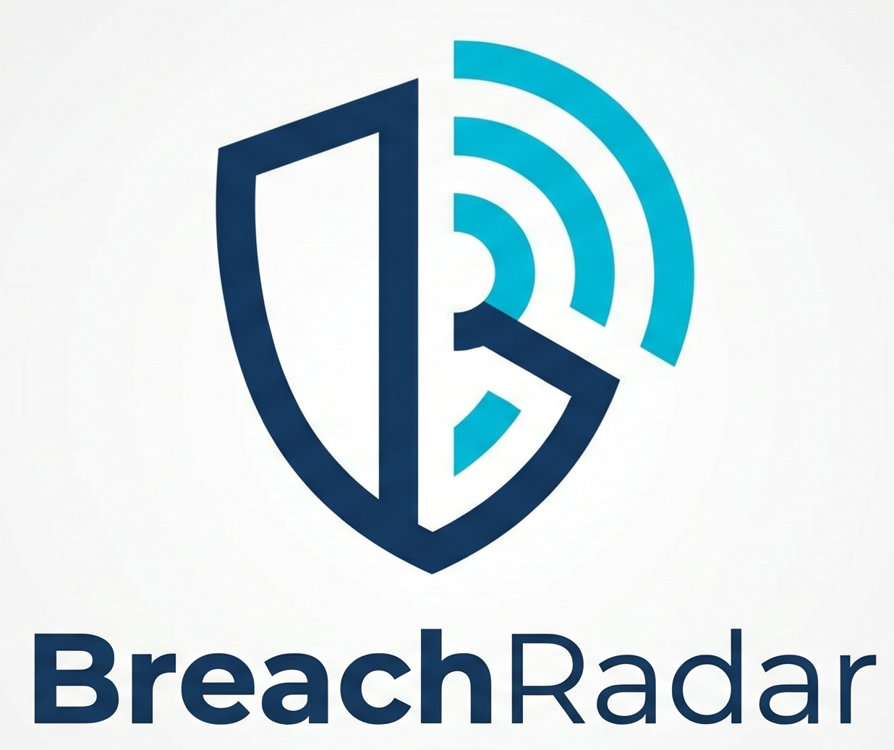

# 🔍 BreachRadar WebUI



> **Domain-targeted data breach detection web platform.**
> Legal use — defensive monitoring of your own domain only.
> Framework: Defensive OSINT — GDPR Art. 6.1.f (legitimate interest)

[](https://www.python.org)
[](https://nextjs.org/)
[](https://www.gnu.org/licenses/agpl-3.0)
[](https://github.com/skrylexx/BreachRadar/actions)

---

## Overview

**BreachRadar is a sovereign Threat Intelligence (CTI) aggregator.**
It detects if data belonging to a domain (`@mydomain.com`) has been compromised by querying and unifying dozens of public sources and specialized APIs (Clear, Deep, and Dark Web) simultaneously.

🛡️ **The promise for SOC & CERT teams:**
> Stop scattering your analysts across 5 different tools. BreachRadar centralizes breach detection, monitors Ransomware group activity in real-time, and generates **neutral and actionable reports (zero sensitive data stored)** directly in a unified web interface (WebUI). Increase reactivity and divide your qualification time by three.

**Two complementary detection dimensions:**

| Dimension | Description | Aggregated Sources |
|---|---|---|
| **Backward-looking** | Past data leaks and compromised passwords | HIBP, LeakCheck, Dehashed, IntelX... |
| **Forward-looking** | Ransomware Early Warning — domain listed before publication | **RansomLook** (Active Dark Web monitoring) |

> ⚠️ **RansomLook** is the only source capable of detecting a massive *ongoing* compromise before the data is published. Typical reaction window: 5 to 30 days.

---

## Technical Architecture

BreachRadar operates with a full micro-services architecture, encompassing a rich web application and a high-performance asynchronous engine.

### WebUI & Engine Stack

| Layer | Technology |
|---|---|
| **Frontend** | Next.js 15.5 + Shadcn/UI + Tailwind CSS 3.4 (i18n: FR/EN) |
| **Backend (Engine)** | FastAPI (Python 3.12+) |
| **Database** | PostgreSQL 16 (Alert and report persistence) |
| **Cache / Sessions** | Redis 7 (Distributed locks and rate-limiting) |
| **Authentication** | JWT HttpOnly Cookies |
| **MFA** | TOTP RFC 6238 (Google Auth, Authy, Microsoft Auth) |
| **Scheduling** | APScheduler 3.x (integrated in FastAPI, synchronized via Redis) |
| **CI/CD & Security** | GitHub Actions (Mypy, Ruff, Bandit, ESLint, pip-audit, detect-secrets) |
| **Package manager** | uv (Backend), npm (Frontend) |

---

## Prerequisites

- **Docker + Docker Compose v2** (For simplified execution):
  ```bash
  docker --version        # >= 24.x
  docker compose version  # >= 2.x
  ```
- *Optional (Development)*: Python 3.12+, `uv`, Node.js 20+

---

## Quick Start (Production)

The tool runs entirely via Docker. There is no longer a command-line interface (CLI); everything is manageable from the WebUI.

```bash
# 1. Clone the project
git clone https://github.com/yourorg/breachradar.git
cd breachradar

# 2. Configure environment variables
cp .env.example .env
# Edit .env with your API keys and set secure passwords 
# (UI_DB_PASSWORD, UI_REDIS_PASSWORD, UI_JWT_SECRET, UI_ADMIN_EMAIL, UI_ADMIN_PASSWORD)

# 3. Launch the platform
docker compose up -d

# 4. Access the interface
# Open your browser at http://localhost:3000
```

> **Note on RansomLook**:
> - By default, the stack starts in **local mode**: RansomLook is deployed in Docker and accessible only internally (`http://ransomlook-app:8888`).
> - To use the hosted RansomLook API (**SaaS mode**), set in `.env`:
>   - `RANSOMLOOK_MODE=saas`
>   - `RANSOMLOOK_SAAS_API_URL=https://www.ransomlook.io/api`
>   - `RANSOMLOOK_SAAS_API_KEY=<key obtained from your RansomLook account>`
>   then restart `docker compose up -d`.
> - The Backend API automatically adds the `Authorization` header when `RANSOMLOOK_MODE=saas`.

---

## API Key Configuration

See [`.env.example`](.env.example) for the full list.

| Key | Source | Cost | Priority |
|---|---|---|---|
| `TARGET_DOMAIN` | The domain you are monitoring | *NA* | **Required** |
| `HIBP_API_KEY` | haveibeenpwned.com/API/Key | ~3.50 USD/month | **Essential** |
| `GITHUB_TOKEN` | github.com/settings/tokens | Free | **Essential** |
| `URLSCAN_API_KEY` | urlscan.io | Free | **Essential** |
| `OTX_API_KEY` | otx.alienvault.com | Free | **Essential** |
| `LEAKCHECK_API_KEY` | leakcheck.io | ~10 USD/month | Highly recommended |
| `DEHASHED_API_KEY` | dehashed.com | ~5 USD/month | Highly recommended |

For RansomLook:

- **Local mode** (default):
  - `RANSOMLOOK_MODE=local`
  - `RANSOMLOOK_LOCAL_URL=http://ransomlook-app:8888`
- **SaaS mode**:
  - `RANSOMLOOK_MODE=saas`
  - `RANSOMLOOK_SAAS_API_URL=https://www.ransomlook.io/api`
  - `RANSOMLOOK_SAAS_API_KEY=<API key obtained from your RansomLook account>`

Search terms can be enriched via:

- `RANSOMLOOK_SEARCH_TERMS`: list of commercial names / subsidiaries, separated by commas.

---

## Project Structure

The structure has been simplified for a 100% WebUI architecture.

```
breachradar/
├── README.md                 # This file
├── ROADMAP.md                # Project tracking
├── Makefile                  # Dev command shortcuts
├── .env.example              # Unified environment variables
├── docker-compose.yml        # Full stack (Postgres, Redis, API, UI, RansomLook)
│
├── backend/                  # FastAPI API + BreachRadar Engine
│   ├── Dockerfile
│   ├── pyproject.toml        # Dependencies (uv)
│   ├── tests/                # Unit tests
│   └── app/
│       ├── main.py           # FastAPI entry point
│       ├── core/             # Global configuration (Settings), DB init
│       ├── clients/          # Connectors (HIBP, GitHub, RansomLook...)
│       ├── engine/           # Business logic (Orchestrator, Scheduler, Sanitizer)
│       ├── models/           # SQLAlchemy models (Users) & Pydantic (Findings)
│       ├── routers/          # API endpoints (Scans, Users, Auth, Webhooks)
│       └── services/         # Notifications, Reports, Resolvers
│
└── frontend/                 # Next.js Application
    ├── Dockerfile
    ├── package.json
    ├── src/
        ├── app/              # App Router routing (Next 15)
        ├── components/       # Reusable components (Shadcn, Recharts)
        └── lib/              # Utilities (api.ts, i18n)
```

---

## SOC Governance and RBAC

BreachRadar integrates strict role management to meet SOC requirements.

| Action | Admin | Viewer |
|---|---|---|
| View main dashboard | ✅ | ✅ |
| Consult alert history | ✅ | ✅ |
| Export reports (PDF, CSV) | ✅ | ✅ |
| Trigger manual scan | ✅ | ❌ |
| Modify configuration (API Keys, SMTP) | ✅ | ❌ |
| Manage users (RBAC) | ✅ | ❌ |
| Access full Audit Logs | ✅ | ❌ |

---

## Security Guarantees

- ❌ No passwords, hashes, or credentials stored in plain text.
- ❌ No .onion URLs in exported reports.
- ✅ Sanitizer applied to all raw data before display or storage in the database.
- ✅ Temporary data purged in memory after processing.
- ✅ API keys only in `.env` or encrypted in the database (Fernet).
- ✅ **SOC Authentication**: Mandatory MFA (TOTP) for admin, backup codes, and robust session management.
- ✅ **Digital & Cyber Intelligence**: Real-time feeds (RSS/Atom, GitHub) with intelligent keyword and severity filtering.
- ✅ **Demonstration Mode**: Ability to display secure fake data (Mocks) to test the interface without real API keys.
- ✅ RansomLook exposed only on the internal Docker network (never `0.0.0.0`).
- ✅ Strong authentication (JWT HttpOnly + mandatory MFA for Admin).

---

## Contributing

**Feel free to contribute!** Whether it's reporting a bug, suggesting a new feature, or adding an OSINT connector, all contributions are welcome.

1.  Check the [ROADMAP.md](ROADMAP.md) to see what's planned.
2.  Read the [CONTRIBUTING.md](CONTRIBUTING.md) guide for coding standards and pull request procedures.

---

## Legal Framework

| This project DOES | This project DOES NOT |
|---|---|
| Query legitimate public APIs | Access unauthorized systems |
| Monitor your own domain | Monitor third-party domains |
| Process in memory and secure DB | Long-term storage of personal data |
| Report without sensitive data | Resell or share findings |

**Legal Basis**: GDPR Art. 6.1.f (legitimate interest) + NIS2 Directive (transposed late 2024).

> ⚠️ Using this on domains that do not belong to you may constitute an offense under the Penal Code and GDPR.
